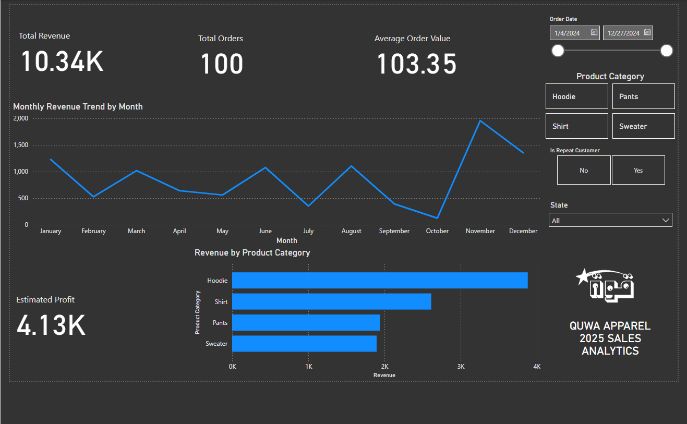
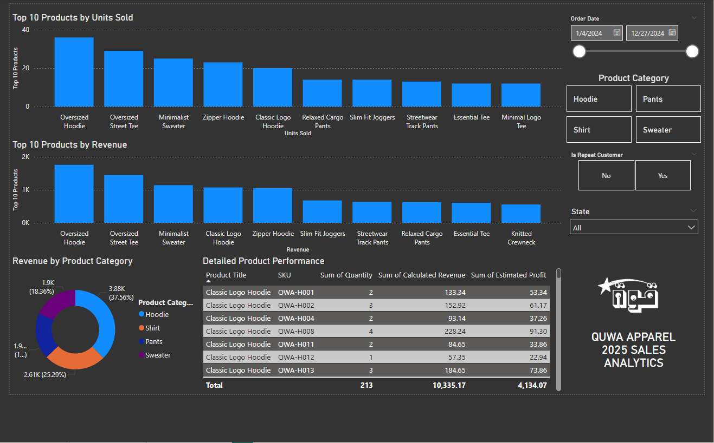

# 🧵 Quwa Apparel Sales Analysis Dashboard
**By Zuhayr Chowdhury**

This project analyzes sales data from **Quwa Apparel** — my own streetwear clothing brand — using **Python** and **Power BI**. The goal is to uncover key business insights, identify top-performing products, and make better decisions for inventory, marketing, and customer engagement.

---

## 🎯 Project Objective

As the founder of Quwa Apparel, I wanted to use real sales data to better understand how our products perform, when customers buy most, and what drives revenue growth. This project combines technical data skills with business decision-making to:

- Track revenue trends and product performance
- Identify top-selling and high-margin items
- Compare new vs repeat customer behavior
- Support better decisions for marketing, restocks, and seasonal drops

By building this dashboard, I aimed to bridge the gap between analytics and real-world action for a growing streetwear brand.

---

## 📦 About Quwa Apparel

Quwa Apparel is a modest streetwear brand I founded, inspired by purpose, community, and clean design. This analysis uses simulated Shopify-style data to reflect real-world sales activity across seasonal promotions like **Eid**, **Black Friday**, and **Winter hoodie drops**.

---

## 🧠 Tools Used

- **Python (Pandas)** – for data cleaning and preprocessing
- **Power BI** – for interactive dashboard and visual storytelling
- **Shopify-style CSV** – simulated export of order-level data

---

## 📌 Key Insights & Takeaways

- **Hoodies generated the most revenue**, especially during the Winter Sale — confirming strong seasonal demand.
- The **“Oversized” product line consistently ranked as a top performer**, both in units sold and revenue.
- **Repeat customers made up a smaller portion of revenue**, highlighting an opportunity to improve retention through loyalty campaigns.
- Most revenue came from **new customers**, showing strong acquisition — but retention strategies could unlock additional growth.
- **April (Eid Sale)** and **November (Black Friday)** saw revenue spikes, confirming the impact of seasonal drops.
- The **Average Order Value (AOV)** stayed strong across months, suggesting healthy pricing and product bundling.
- Using this analysis, I can make better decisions about **restocks, drop timing, and targeted marketing efforts** for Quwa Apparel.

---

## 📊 Dashboard Overview

The dashboard contains two main pages:

### 1️⃣ Executive Summary
- Total Revenue, Orders, Average Order Value
- Monthly Revenue Trends
- Revenue by Product Category
- Estimated Profit

### 2️⃣ Product Performance
- Top-selling products by units & revenue
- Revenue by category
- Detailed product performance table

---

## 📷 Dashboard Preview

Below are screenshots of the two main pages from the Power BI dashboard created for Quwa Apparel.

### 🧾 Page 1: Executive Summary

---

### 📦 Page 2: Product Performance

---

## 📁 Files Included

| File | Description |
|------|-------------|
| `quwa_apparel_sales_analysis.ipynb` | Python notebook for data cleaning and exploratory insights |
| `quwa_sales_data.csv` | Simulated Shopify-style sales data |
| `quwa_dashboard.pbix` | Power BI dashboard file with two-page visual analysis |
| `images/` | Screenshots of dashboard pages (for GitHub preview) |
| `README.md` | This project overview and guide |

---

## ✍️ Created by Zuhayr Chowdhury

- Founder of **Quwa Apparel**
- Aspiring Data Analyst  
- Passionate about using data to drive real-world business growth

